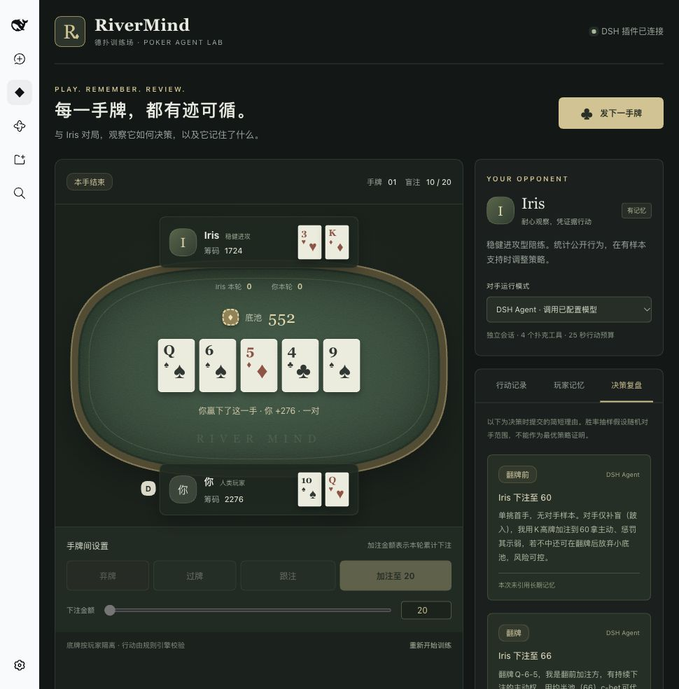

# RiverMind · 德扑训练场

基于 DeepSeek Harness 的德扑 Agent 项目：独立玩家、受限工具、可追溯决策，以及按玩家保存的长期记忆。

当前是第一个可运行里程碑：**你与 Iris 的双人无限注德扑训练桌**。先验证完整牌局和真实 DSH Agent，再扩展到六人桌与策略评估。

## 启动

需要 Node.js 22+ 和已经安装、配置好模型的 DeepSeek Harness。已对照本机 DSH **0.2.0-rc.2** 接口开发。

运行：

    npm install
    npm run build
    npm run start:dsh

启动日志会给出 DSH 的本地访问地址；使用日志中的带认证参数地址首次打开。在 DSH 左侧点击 **RiverMind 德扑训练场**，再点击 **开始第一手**。

插件默认使用 DSH 中已配置的模型。没有另行存储或要求填写 API Key。模型调用会使用你的 DSH 账号或 API 配额。单次行动预算为 25 秒、最多 6 次工具调用；超时或提交失败会明确标记安全兜底。

端口默认为 3080。如果端口已被占用：

    RIVERMIND_DSH_PORT=3081 npm run start:dsh

这里只通过启动覆盖层加载本地插件，不修改现有 profile 的插件配置。桌面安装包提供的 dsh 命令可以启动这个 Web profile；直接在桌面 profile 中安装尚未单独验证。

## 不调用模型的本地预览

    npm run dev

打开 http://127.0.0.1:4317 。该预览明确标注为**规则陪练**，用于验证 UI 和扑克规则，不会伪装成 DSH 模型对手。DSH 牌桌也可以在两手牌之间切换到此模式。

## 当前能力

- 双人牌桌：交替庄位、小盲 / 大盲、弃牌、过牌、跟注、加注、全下跑牌及摊牌结算。
- 后端校验行动者、手牌编号、状态版本与合法金额。加注金额表示当前下注轮的累计金额。
- 独立 Iris Agent：新建会话，不继承其他会话；没有文件、Shell、联网、子 Agent 等全局工具。
- 四个扑克工具：get_observation、recall_opponent、estimate_equity、submit_action。
- 决策时记录简短理由与记忆引用；手牌结束后开放当前手牌复盘。
- 长期保存公开对手统计：观察手数、弃牌手数、翻牌前主动入池手数、出现进攻行动的手数及证据手牌编号。
- 明确区分真实 DSH 决策、规则陪练决策和安全兜底。

规则陪练的牌力估算使用未知牌抽样，并假设随机对手范围，不能视为 GTO 求解器。当前未实现六人桌、CFR/RL、自主策略升级、完整历史复盘 UI 或中断牌局恢复。

## 数据

运行数据位于 .data/，已被 Git 忽略：

- iris-memory.json：Iris 对人类玩家的公开行为统计，原子替换写入，跨重启保留。
- memory-history.jsonl：带版本标识的记忆快照。
- hands.jsonl：公开手牌事件，不包含底牌或决策理由。
- reviews.jsonl：供人类复盘的已结束手牌视图与决策理由；不会作为 Agent 观察或记忆工具输入。
- rivermind.patch.yml：根据当前项目绝对路径生成的 DSH 启动覆盖层。

“重新开始训练”会重置筹码和牌局，保留 Iris 的长期统计记忆。不要把 .data/ 提交到仓库。

## 开发与验证

    npm run typecheck
    npm test
    npm run build

测试覆盖轮次、牌力比较、全下退款、短额全下、平分底池、底牌和复盘权限隔离、持久记忆幂等、DSH 工具限制及行动关联。另外用 300 手牌随机合法行动验证筹码守恒。

目录：

    src/core/       规则、牌力评估、观察视图与规则陪练
    src/host/       DSH 适配、牌局调度、持久记忆与本地预览服务
    src/client/     牌桌、操作区、记忆及复盘面板
    scripts/        构建与 DSH 启动覆盖层
    tests/          规则与 Agent 边界测试
    docs/           架构与后续开发方向

架构说明见 [docs/architecture.md](docs/architecture.md)。
