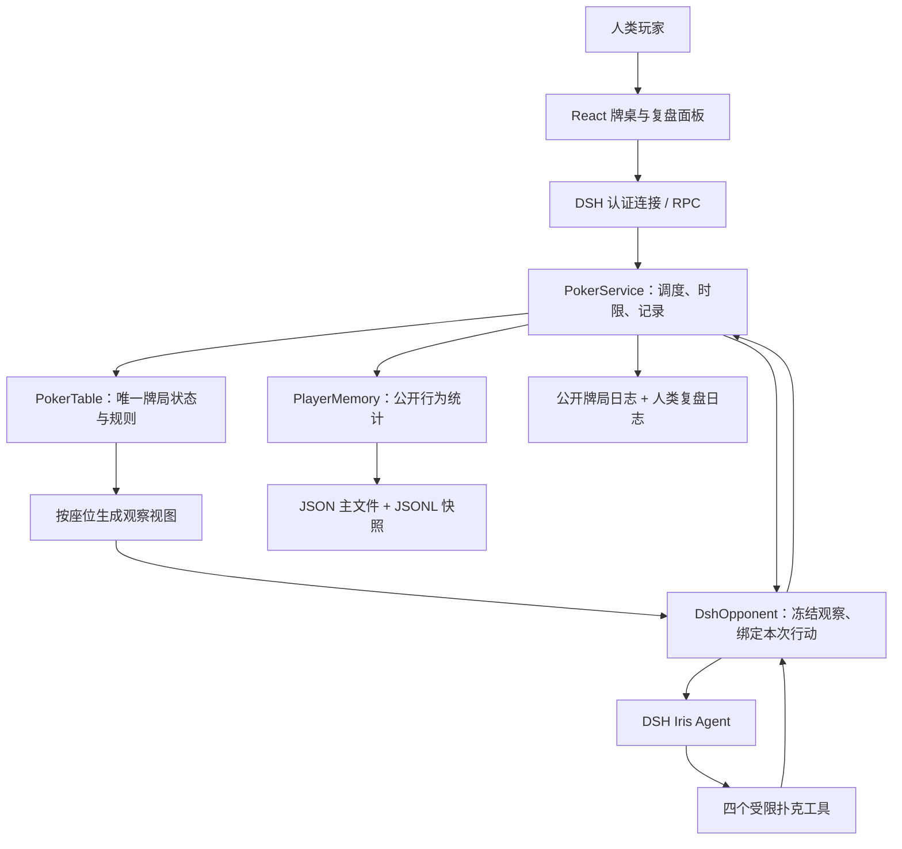
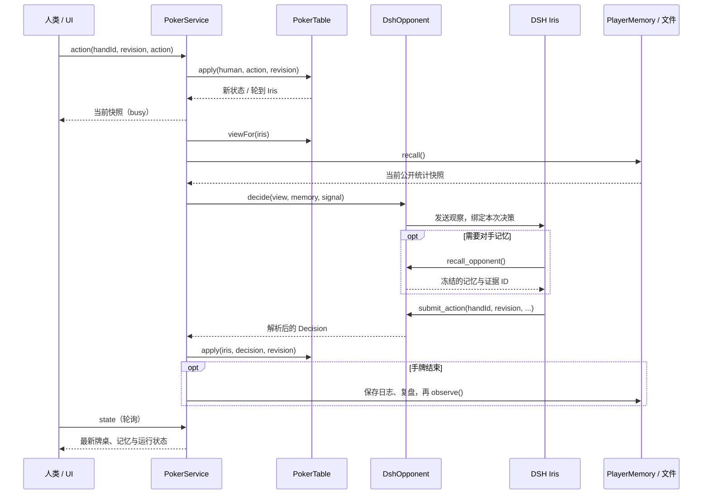

# RiverMind v0.1 技术方案

> 历史快照，保留该里程碑的实现与验证记录；当前规范统一见 [当前技术设计](../technical-design.md)。源码链接指向当前源码，需结合对应 Git 提交理解。

> 本文保留为 v0.1 历史记录。当前实现请阅读 [v0.2 技术方案](technical-design-v0.2.md)，其代码链接指向当前源码，部分内容已随新版变化。

本文对应当前 `0.1.0` 版本，按“系统怎么工作 → Agent 怎么决策 → 记忆怎么保存 → 如何验证”展开。所有示例手牌编号和数据均为虚构，不引用真实训练日志。

第一次阅读建议先看第 1～4 节，再重点看第 7 节的记忆示例；准备面试可以结合第 10～12 节。安装步骤见[项目 README](../../README.md)，简版架构见[架构速查](../architecture.md)。

## 1. 当前项目解决什么问题

RiverMind 是一个运行在 DeepSeek Harness（DSH）中的德扑训练插件。当前只有两个座位：人类玩家 `human` 和 AI 对手 `iris`。核心问题是：**让一个有独立身份的 Agent，在不掌握对手私有信息的条件下，根据合法观察和历史公开行为持续决策，并留下可检查的记录。**

扑克为这个问题提供了明确的约束：隐藏信息、轮流行动、合法动作、筹码守恒、决策时限和可度量的比赛结果。界面是训练入口，规则引擎负责比赛事实，Agent 负责在给定动作范围内选择行动。

| 能力 | 当前实现 | 边界 |
| --- | --- | --- |
| 牌桌 | 双人无限注德扑，完整下注轮、全下跑牌和摊牌结算 | 六人桌、边池、多 AI 尚未实现 |
| AI 玩家 | 一个独立 DSH Agent：Iris；另有可切换的规则陪练 | 人格由提示词定义，尚无经过评估的难度等级 |
| 记忆 | 跨重启保存人类玩家的公开行为统计，带快照 ID 和证据编号 | 尚无向量检索、局面经验、自动反思或策略升级 |
| 复盘 | 当前已结束手牌的行动、简短理由、记忆引用 | 历史文件已保存，历史选择与逐步回放 UI 尚未实现 |
| 持续运行 | 每个行动有时限、工具预算、取消与兜底机制 | 未完成一小时连续比赛的稳定性与成本评估 |
| 验证 | 规则、信息隔离、工具边界和记忆持久化测试 | 尚不能证明 Iris 强于某个水平的玩家 |

当前没有接入 AgentScope；DSH 承担 Agent 运行时与插件容器，RiverMind 实现牌局、工具和应用记忆。后续可以替换 Agent 适配器，但当前不是同时使用两个 Agent 框架。

## 2. 先区分四种“状态”

这是理解本项目最重要的区分。

| 类型 | 由谁管理 | 保存在哪里 | 用途 |
| --- | --- | --- | --- |
| 当前牌局状态 | `PokerTable` | 进程内存 | 底牌、牌组、公共牌、筹码、轮次、合法行动与结果 |
| Agent 会话上下文 | DSH Agent 会话 | DSH 运行时管理；本项目不实现其存储 | 同一会话中的观察输入和工具输出，可能保留前几手的信息 |
| 应用长期记忆 | `PlayerMemory` | `iris-memory.json` 与快照日志 | 重新启动后恢复对人类对手的公开行为画像 |
| 对局与复盘记录 | `PokerService` | `hands.jsonl`、`reviews.jsonl` | 保留事件与人类复盘材料；当前不恢复整张牌桌 |

例如，“Iris 重启后仍记得人类曾频繁弃牌”来自应用长期记忆；“Iris 在当前会话里记得上一手看过的输入”属于会话上下文。两者会同时影响模型，需要在评估中分别控制。

对熟悉 Java 的开发者，可以把 `PokerService` 看作应用服务，`PokerTable` 看作维护领域不变量的规则对象，`DshOpponent` 看作运行时适配器，`PlayerMemory` 看作持久化组件。当前是一个进程、一张牌桌、一个固定对手身份。

## 3. 系统分层



| 层 | 关键文件 | 职责 |
| --- | --- | --- |
| 客户端 | [App.tsx](../../src/client/App.tsx)、[index.tsx](../../src/client/index.tsx) | 牌桌、操作区、模式切换、记忆和复盘；注册 DSH 主面板与侧栏 |
| Host 接入 | [host/index.ts](../../src/host/index.ts) | 注册受认证的精确接口，检查请求格式，绑定插件生命周期与数据目录 |
| 应用服务 | [service.ts](../../src/host/service.ts) | 人类请求绑定、AI 回合推进、决策时限、兜底、结束手牌写盘 |
| 规则核心 | [engine.ts](../../src/core/engine.ts)、[cards.ts](../../src/core/cards.ts) | 发牌、下注、结算、合法视图、牌力比较及未知牌抽样 |
| Agent 适配 | [dsh.ts](../../src/host/dsh.ts) | 创建 Iris 会话，收窄能力，注册工具，关联输入与动作结果 |
| 长期记忆 | [memory.ts](../../src/host/memory.ts) | 启动加载、公开行为统计、去重、快照与持久化 |
| 规则陪练 | [baseline.ts](../../src/core/baseline.ts) | 无模型的可解释策略；用于功能验证与对照 |
| 打包与开发启动 | [package.json](../../package.json)、[cordis.patch.yml](../../cordis.patch.yml)、[start-dsh.mjs](../../scripts/start-dsh.mjs) | 声明 DSH bundle 与客户端入口，构建、安装、临时加载 |

技术栈是 Node.js 22+、TypeScript、React 和 esbuild；当前 DSH 适配针对 `0.2.0-rc.2`。前端复用 DSH 提供的 React，Host 不引入第二套 Cordis 运行时。

## 4. 一次操作如何走完整个系统

以“你点击跟注，轮到 Iris 决策”为例：

1. 前端提交当前 `handId`、`revision` 和动作。`revision` 表示牌局状态版本，用于识别过期操作。
2. DSH 认证连接把请求送到 RiverMind Host。Host 校验 RPC 信封和 JSON 格式，再调用 `PokerService.dispatch`。
3. 服务把 HTTP 调用者固定为 `human`，不会信任请求里自报的 `playerId`。
4. `PokerTable.apply` 检查轮次、版本与金额，执行人类动作并推进状态；客户端得到快照。
5. 若当前轮到 Iris，服务置为 `busy`，生成只含 Iris 底牌与公开信息的观察，并取得当前记忆快照。
6. `DshOpponent` 给 Iris 发送观察。Iris 可读取工具信息，必须通过 `submit_action` 提交合法动作才能完成这次决策。
7. 服务收到结构化结果后交给规则引擎再次校验和执行；失败或超时执行明确标记的兜底。
8. 若手牌已结束，服务保存事件、复盘与记忆更新。前端轮询得到最新状态，开放当前手复盘。



AI 推进是异步的，前端每 750 毫秒轮询状态。前端防止重复提交，并用请求顺序避免较早返回的快照覆盖较新的状态；后端仍以版本校验为准。

| 接口 | 用途 | 主要约束 |
| --- | --- | --- |
| `state` | 获取快照 | 只能取得人类可见视图 |
| `deal` | 开始下一手 | 状态版本正确，符合开局条件 |
| `action` | 人类行动 | 手牌编号、状态版本、当前轮次、合法动作 |
| `mode` | 切换 DSH / 规则陪练 | 两手牌之间，DSH 模式需有运行时 |
| `reset` | 重新开始训练 | 手牌已结束，重置牌桌并保留记忆 |

DSH Host 使用 `/api/rivermind/{endpoint}` 的 POST 路由，要求匹配的 RPC 信封，限制请求文本长度为 16,384，并禁用响应缓存。本地预览使用独立开发服务，最终调用同一个 `PokerService`。

## 5. Iris 如何作为 Agent 工作

### 5.1 身份与会话

每次插件服务启动都会构造新的 `DshOpponent`，第一次需要决策时才创建 DSH Agent。会话 ID 是 `rivermind-iris-` 加随机 UUID，不继承父会话，不使用 seed 或 fork。

同一服务中复用这个 Agent 句柄，因此运行时会话可能保留之前的输入与工具输出。“重新开始训练”只重置牌桌，不替换这个对手；插件重启会创建新会话，再从文件加载统计记忆。

提示词把 Iris 定义为冷静、纪律性强的紧凶型对手，并要求遵守可见信息、合法动作、样本限制和工具预算。这只是行为设定；它不能证明 Iris 已达到职业玩家水平。

### 5.2 工具与选择空间

初始化时先屏蔽全局工具，移除工作区等动态上下文，再注册四个扑克工具。文件、Shell、联网和子 Agent 等能力不提供给 Iris。

| 工具 | 输入 / 输出 | 是否必须调用 |
| --- | --- | --- |
| `get_observation` | 返回本次决策绑定的自身底牌、公开牌面与行动、合法选择 | 可选；观察已随本次输入发送 |
| `recall_opponent` | 返回 Iris 对固定 `human` 的公开统计与快照 ID | 可选；引用记忆时必须先调用 |
| `estimate_equity` | 仅从可见牌抽样，估计对随机对手范围的胜率；默认 120 次，最多 200 次 | 可选；不是 GTO 求解器 |
| `submit_action` | 校验后提交唯一动作、简短理由与记忆引用，结束本次 Agent 输入 | 必须成功提交，服务才收到模型决策 |

工具通过闭包绑定当前观察、身份和记忆，不接受任意玩家 ID。模型无法通过改变参数读取人类底牌，或访问其他对手的画像。

假设本次允许免费过牌，并且已经调用 `recall_opponent` 返回 `v2`，有效提交可以是：

```json
{
  "handId": "demo-match:3",
  "revision": 42,
  "type": "check",
  "rationale": "当前可以免费过牌；公开样本仅两手，暂不因对手画像改变策略。",
  "memoryIds": ["iris:human:public-stats:v2"]
}
```

加注使用 `type: "raise"` 和 `amount`；金额是**该下注轮的累计投入**，不是本次追加数额。理由必须非空且不超过 500 字符，记忆引用最多一条。工具 schema 限制参数形状，执行逻辑另做合法性校验，规则引擎最后复核。

## 6. 如何保证动作可靠、信息公平

### 6.1 关联本次输入与动作结果

每次决策有唯一的 `handId + revision`，还绑定一份复制的观察与记忆。`submit_action` 只接受与这次请求匹配的动作；首次成功后清除 pending 并调用 `concludeTurn`，晚到、重复或过期提交不能再次驱动牌桌。

`whenIdle()` 只协调 Agent 生命周期，在下一次输入前等待空闲；**它不是这次行动的完成凭据**。真正完成决策的是有效 `submit_action` 对当前 Promise 的解析。这是异步 Agent 与业务状态机之间的关键边界。

### 6.2 时限与失败处理

每次行动总时限为 25 秒，包括会话创建、等待空闲和实际决策；最多 6 次工具调用。`maxTokens: 2048` 限制单次模型响应输出，并不代表整场比赛或整个决策的总 token 上限。

超时、工具预算耗尽或无法完成合法提交会取消当前输入，服务选择“可以免费过牌就过牌，否则弃牌”。记录明确区分 `human`、`dsh`、`baseline` 和 `fallback`，便于复盘和后续统计失败率。

### 6.3 信息可见范围

| 信息 | 对局中的 Iris | 对局中的人类界面 | 已结束手牌的人类复盘 |
| --- | --- | --- | --- |
| 人类底牌 | 不提供 | 可见自己的牌 | 可见 |
| Iris 底牌 | 可见自己的牌 | 隐藏 | 摊牌时可见，弃牌结束仍隐藏 |
| 已发公共牌、公开动作 | 可见 | 可见 | 可见 |
| 未来公共牌、实际剩余牌组 | 不提供 | 不提供 | 不保存完整牌组供回看 |
| Iris 简短决策理由、记忆引用 | 模型知道自己提交的内容；观察视图隐藏这些字段 | 手牌结束前隐藏 | 手牌结束后可见 |
| 人类行为统计 | 调用记忆工具读取 | 记忆面板可见 | 保存该手更新前快照 |

`PokerTable` 持有完整状态，按座位投影出视图；原始牌桌对象不会直接交给模型。胜率工具重新抽样未知牌，不读取真实牌组。公开历史剥离理由和记忆引用，记忆统计只读公开动作。

这些是应用层与 Agent 能力边界，不是针对其他本机进程的操作系统沙箱。模型自由文本的披露限制见第 8 节。

## 7. 记忆如何保存和使用

### 7.1 数据目录在哪里

目录由启动方式决定。显式配置 `dataDir` 优先于默认值；相对路径按进程工作目录解析。

| 启动方式 | 默认数据目录 | 说明 |
| --- | --- | --- |
| `npm run start:dsh` | 项目目录下的 `.data/` | 开发脚本生成 patch，显式指定此目录 |
| `npm run dev` | 启动工作目录下的 `.data/` | 在项目目录执行即为项目内 `.data/` |
| 常规安装进 DSH profile | `~/.dsh/data/rivermind/` | 使用固定位置，不依赖桌面启动工作目录 |
| 设置 `DSH_HOME` 后常规安装 | `$DSH_HOME/data/rivermind/` | `DSH_HOME` 为空时回退到 `~/.dsh`，支持展开 `~/` |
| 自定义插件 `dataDir` | 指定目录 | 覆盖以上安装默认值 |

开发目录与安装目录彼此独立，**不会自动迁移记忆**。Desktop 和 Web 若使用同一个 DSH home，也会指向同一份默认数据；当前没有多进程协调，应使用单个训练实例写入。

### 7.2 四个文件分别是什么

| 文件 | 内容 | 启动时是否读取 | 是否作为记忆工具输入 |
| --- | --- | --- | --- |
| `iris-memory.json` | 已观察手牌编号集合和三个累计计数 | 是；校验格式后恢复画像 | 是；转换为 `OpponentMemory` 后返回 |
| `memory-history.jsonl` | 每次更新后的画像快照，一行一条 JSON | 否 | 否；当前工具只读最新快照 |
| `hands.jsonl` | 公开牌局结果和事件，不含底牌或决策理由 | 否 | 否；证据 ID 可用于后续定位这些记录 |
| `reviews.jsonl` | 人类可见的已结束手牌视图，以及更新前的记忆快照 | 否 | 否；与 Agent 记忆来源分离 |

开发时另有 `.data/rivermind.patch.yml`，它是含本地入口路径的启动配置，不是记忆。训练目录已被 Git 忽略；迁移时只复制四个数据文件，不复制开发 patch。

### 7.3 主文件的实际格式

假设已经完成两手训练，主文件为：

```json
{
  "version": 1,
  "handIds": ["demo-match:1", "demo-match:2"],
  "folded": 1,
  "voluntary": 1,
  "aggressive": 0
}
```

各字段都按“手”统计，一手中符合条件一次或多次都只增加一次：

- `version` 是文件格式版本，当前固定为 `1`，不是学习轮次或策略版本。
- `handIds` 保存所有已观察的唯一结束手牌编号；它既是去重集合，也决定观察手数。即使人类该手没有行动，也会计入已结束手数。
- `folded`：人类在该手出现过弃牌动作。
- `voluntary`：人类在翻牌前出现过跟注或加注；盲注不计入。
- `aggressive`：人类在任意下注轮出现过 `raise`；当前规则用该类型表达主动下注或加注。

这里没有底牌、自然语言经验、向量或模型参数。计数也不是完整的专业 HUD：目前没有按位置、下注轮、下注尺度或具体决策机会分母拆分统计。

### 7.4 Iris 实际读取的格式

`PlayerMemory.recall()` 将上面的持久状态转换成工具返回值：

```json
{
  "id": "iris:human:public-stats:v2",
  "ownerId": "iris",
  "opponentId": "human",
  "handsObserved": 2,
  "handsFolded": 1,
  "voluntaryHands": 1,
  "aggressiveHands": 0,
  "evidenceHandIds": ["demo-match:1", "demo-match:2"],
  "summary": "共观察 2 手：弃牌 1 手，翻牌前主动入池 1 手，出现主动下注或加注 0 手。 样本较少，判断应保守。"
}
```

`v2` 表示已经观察两手；当前每增加一手，就产生新的画像 ID。`summary` 是程序根据计数拼接的文本，不是 LLM 总结。零样本禁止形成风格结论，少于十手会提示判断保守。

统计覆盖全部已观察手牌，`evidenceHandIds` 只展示最近八个编号。截取证据列表不等于遗忘旧样本；当前没有衰减、过期、置信区间或按局面搜索。检索方式是固定身份的精确读取，没有 embedding、向量数据库或 top-k 检索。

### 7.5 什么时候更新

一手牌中使用同一版画像，更新只发生在手牌结束后。具体顺序由 `PokerService.recordCompletedHand()` 和 `PlayerMemory.observe()` 实现：

1. 确认牌局已结束，并且当前进程没有记录过这个 `handId`。
2. 取得公开事件，追加到 `hands.jsonl`。
3. 将人类复盘视图与**更新前**记忆写入 `reviews.jsonl`。
4. `observe()` 再确认存在 `finished` 事件，且 `handId` 未在已观察集合里。
5. 从人类公开动作计算该手是否弃牌、主动入池、进攻，更新累计值。
6. 先写 `iris-memory.json.tmp`，再 rename 替换主文件。
7. 追加更新后的 `memory-history.jsonl`，标记本手已记录。

例如第 3 手人类翻牌前跟注、转牌弃牌且没有主动加注，则观察手数变为 3，`folded` 变为 2，`voluntary` 变为 2，`aggressive` 仍为 0，下一次读取的 ID 为 `v3`。第 3 手决策和该手复盘记录仍对应更新前的 `v2`，不会把结果倒灌成当时已知信息。

主文件的临时写入再替换用于避免读到半份 JSON，`handId` 去重用于避免重复累计同一手。但四个文件并非一个事务；磁盘错误或写盘中断可能使日志与画像不完全一致。当前不承诺所有记录恰好一次写入，也没有从日志自动重建记忆的恢复流程。

### 7.6 记忆如何影响决策

真实 DSH 模式下，Iris 判断是否需要调用 `recall_opponent`。如果提交动作引用记忆，工具会验证：本次确实读取过记忆、ID 与冻结快照一致、样本数大于零。不能编造一个记忆 ID 混进复盘。

这能证明“该决策读取过这份记忆，并引用了有效快照”，还不能证明记忆真正改变了选择，或者提高了胜率。要证明收益，需要第 12 节所述的对照实验。

规则陪练有一处明确的适配逻辑：观察至少 10 手且人类弃牌手数占比超过 55% 时，把加注的抽样胜率阈值从 `0.67` 调到 `0.63`。这是手工设计的规则调整，不是模型训练或自主策略学习。

### 7.7 重置、重启与迁移

| 操作 | 牌局状态 | 文件记忆 | 当前 DSH 会话 |
| --- | --- | --- | --- |
| 开始下一手 | 延续筹码，开启新手牌 | 继续累计 | 复用 |
| 重新开始训练 | 新牌桌，筹码和比赛状态重置 | 保留 | 复用 |
| 插件 / 服务重启 | 当前牌局不恢复，创建新牌桌 | 从主文件恢复 | 新建 |
| 开发方式改为常规安装 | 新服务、新牌桌 | 目录不同，需要手动迁移 | 新建 |

人类身份目前固定为 `human`，没有账号隔离；更换真人仍会沿用同一目录下的画像。Iris 的人格来自代码里的提示词，恢复的是对手统计，而非一个经过训练的策略模型。

迁移前完全退出对应 DSH / 开发服务，备份已有目标数据，再复制四个数据文件。文件损坏会阻止记忆初始化，不会悄悄清空；应保留原文件并检查对应数据目录。不要在服务运行时修改或并发复制这些文件。

## 8. 复盘能解释什么

复盘显示已结束手牌的动作、来源、简短理由、记忆 ID，以及当时可用的更新前画像。它用于检查动作是否合理、依据是否有公开证据、是否发生过兜底。

简短理由是模型提交的解释性文本，**不是完整内部思维链，也不能保证忠实反映所有推理过程**。提示词要求不披露确切底牌，但当前没有对自由文本做语义脱敏校验，不能保证理由永远不提私有信息。

结构化观察会隐藏未摊牌的对手底牌，记忆统计也不读取复盘理由。复盘文件保有人类自己的底牌，摊牌时也包含公开的 Iris 底牌，因此应按个人训练数据处理，不能提交到公开仓库。

当前 UI 只能复盘当前已结束手牌；历史日志持久化不等于已经实现历史查找、事件回放或证据跳转。

## 9. 为什么这样设计

| 选择 | 当前收益 | 代价与后续工作 |
| --- | --- | --- |
| 规则引擎掌握事实，模型只提交动作 | 筹码、合法性、胜负可确定性校验 | 扩展六人桌需先补多方底池和加注重开规则 |
| 按座位投影观察，工具绑定身份 | 可测试的不完全信息边界 | 要继续检查所有日志、工具与自由文本出口 |
| 统计画像先行 | 存储透明、能追溯、容易验证与解释 | 表达能力有限，无法检索相似局面经验 |
| 只在手牌结束更新画像 | 决策对应稳定版本，避免使用未来结果 | 不支持手牌内动态画像更新 |
| JSON / JSONL 单进程存储 | 依赖少、便于检查和备份 | 无多写者协调、跨文件事务、索引和自动恢复 |
| 保留规则陪练与兜底标签 | 无模型也可演示，能统计模型失败 | 需在评估中分开统计不同来源 |

## 10. 当前验证证明了什么

[测试文件](../../tests/poker.test.ts) 当前有 13 个测试，覆盖：牌力比较、双人轮次、过期与非法动作、底牌隔离、复盘权限、全下退款、短额全下、平分底池、持久记忆去重与恢复、人类 HTTP 身份绑定、DSH 工具权限和结果关联。其中随机合法行动测试运行 300 手牌，检查筹码守恒与手牌终止。

已有接入验证包括：临时 DSH home 中的 Web profile 本地安装、启动、认证接口和规则模式完整牌局；预构建包离线安装与 Host / 客户端入口加载。真实模型完整牌局也做过人工走通。这些验证支持“插件链路和主要业务边界可工作”，不代表对手水平或长期运行已达标。

尚未完成的验证包括：桌面安装后实际交互验收、发布后的远程 GitHub 安装、长时间运行成本与失败率、固定对手池的胜率 / bb per 100 hands，以及不同记忆方案的对照。

## 11. 可以与面试官讨论的点

| 话题 | 可以展示的亮点 | 应准备回答的难点 |
| --- | --- | --- |
| Harness 与业务 Agent | 将编程运行时收窄为扑克玩家，工具和会话独立 | 提示词限制与强制权限限制有什么区别？ |
| 异步可靠性 | `handId + revision`、绑定 Promise、取消、预算与兜底 | 如何处理晚到结果、重复提交和状态过期？ |
| 不完全信息 | 私有牌局状态与玩家视图分离，胜率工具不窥视牌组 | 如何证明所有信息出口都满足公平性？ |
| 记忆生命周期 | 公开行为 → 去重统计 → 版本快照 → 工具引用 → 复盘 | 记忆有效引用为何不等于记忆提升策略？ |
| 工程验证 | 确定性规则测试、随机筹码守恒测试、运行时模拟与实际接入 | 哪些测试证明业务正确，哪些证明不了 Agent 强弱？ |

可以准确概括为：“我用 DSH 做了一个具备受限工具、持久统计记忆和可检查决策记录的扑克 Agent，先验证了完整业务闭环与信息边界，正在进一步做记忆收益评估。”当前还不适合把它介绍成六人多 Agent 系统、会自主变强的玩家或 GTO AI。

## 12. 下一步如何迭代

建议先补评估，再增加记忆复杂度，避免功能越来越多却无法说明收益：

1. **建立对照实验。** 固定规则对手池和配对发牌种子，比较无记忆、统计记忆、局面经验记忆；统计收益、非法动作、兜底率、耗时和成本。还需统一或重置 DSH 会话上下文，避免“无文件记忆”组仍从历史对话记住对手。
2. **细化统计。** 按位置、下注轮和实际决策机会计算统计，加入样本量、适用条件、置信度和近期变化；拆分玩家身份。
3. **增加经验记忆。** 将可验证的局面、公开证据、候选判断和结果分层存储，按适用条件检索；明确写入门槛与过期规则，不直接把模型理由当成事实。
4. **补历史复盘与恢复。** 用证据编号定位记录，支持回放；引入一致性校验和恢复机制，再考虑数据库与并发写入。
5. **扩展多 AI。** 先完成六人规则、边池和加注重开验证，再为每个座位分配独立观察、会话、身份和记忆命名空间。
6. **做策略迭代。** 让候选经验或策略版本经过离线验证后启用，保留回滚；通过评估证明“更强”，而非依据自述“学到了什么”。

## 13. 相关文档

- [文档导航](../README.md)：按问题定位章节。
- [架构速查](../architecture.md)：现有实现的简版边界说明。
- [项目 README](../../README.md)：安装、启动、发布与常用操作。
