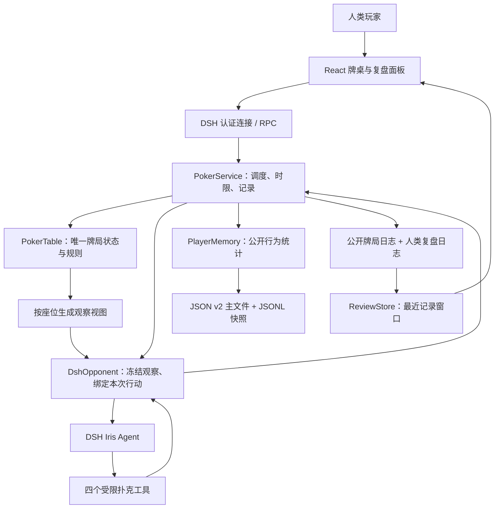
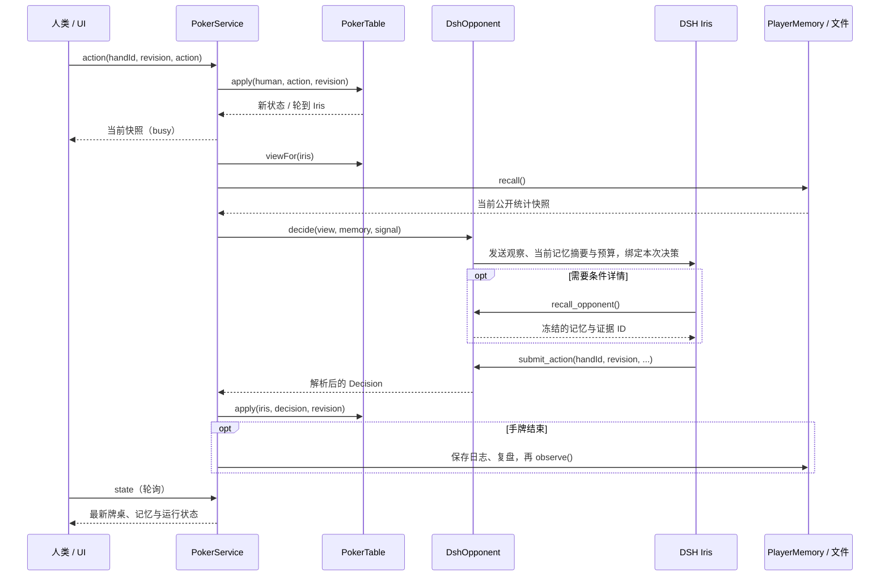

# RiverMind 当前技术设计

适用版本：`0.3.0`。本文描述当前架构、接口、数据格式与实现边界，随源码更新。版本取舍见 [设计演进](design-evolution.md)，使用者更新说明见 [CHANGELOG](../CHANGELOG.md)，发布操作见 [发布指南](publishing.md)。

示例使用合成数据。首次阅读可从第 1～4 节了解整体流程，再阅读第 6～8 节的预算、记忆和复盘；工程设计要点见第 11 节。

## 1. 当前项目解决什么问题

RiverMind 是一个运行在 DeepSeek Harness（DSH）中的德扑训练插件。当前只有两个座位：人类玩家 `human` 和 AI 对手 `iris`。核心问题是：**让一个有独立身份的 Agent，在不掌握对手私有信息的条件下，根据合法观察和历史公开行为持续决策，并留下可检查的记录。**

扑克为这个问题提供了明确的约束：隐藏信息、轮流行动、合法动作、筹码守恒、决策时限和可度量的比赛结果。界面是训练入口，规则引擎负责比赛事实，Agent 负责在给定动作范围内选择行动。

| 能力 | 当前实现 | 边界 |
| --- | --- | --- |
| 牌桌 | 双人无限注德扑，完整下注轮、全下跑牌和摊牌结算 | 六人桌、边池、多 AI 尚未实现 |
| AI 玩家 | 一个独立 DSH Agent：Iris；另有可切换的规则陪练 | 人格由提示词定义，尚无经过评估的难度等级 |
| 记忆 | 跨重启保存累计统计与按下注轮、位置、下注尺度划分的回应画像，带样本量、区间和证据编号 | 尚无向量检索、局面经验、自动反思或策略升级 |
| 复盘 | 已结束手牌的历史选择、逐步回放、证据跳转、简短理由与工具摘要 | 最近 100 条 / 2 MiB 窗口；不恢复未结束牌局 |
| 持续运行 | 每次行动采用持久化的可配置预算、取消与兜底；trace 保存当次配置 | 长时间模型比赛与成本尚未评估 |
| 验证 | 42 项规则 / Agent 边界测试、浏览器交互、打包检查和规则记忆对照 | 工程正确性与规则收益不代表真实模型水平 |

DSH 提供 Agent 运行时、插件加载和认证连接；RiverMind 实现牌局规则、受限扑克工具、应用记忆和复盘界面。

## 2. 先区分五种状态

| 类型 | 由谁管理 | 保存在哪里 | 用途 |
| --- | --- | --- | --- |
| 当前牌局状态及确定性决策事实 | `PokerTable` | 进程内存 | 底牌、牌组、公共牌、筹码、轮次、合法行动与结果 |
| Agent 会话上下文 | DSH Agent 会话 | DSH 运行时管理；本项目不实现其存储 | 同一会话中的观察输入和工具输出，可能保留前几手的信息 |
| 应用长期记忆 | `PlayerMemory` | `iris-memory.json` 与快照日志 | 重新启动后恢复对人类对手的公开行为画像 |
| 对局与复盘记录 | `PokerService` | `hands.jsonl`、`reviews.jsonl` | 保留事件与人类复盘材料；当前不恢复整张牌桌 |
| Iris 决策配置 | `AgentSettings` | `agent-settings.json` | 保存思考时限和工具次数；与长期记忆独立 |

例如，“Iris 重启后仍记得人类曾频繁弃牌”来自应用长期记忆；“Iris 在当前会话里记得上一手看过的输入”属于会话上下文。两者会同时影响模型，需要在评估中分别控制。

运行实例采用单进程、单牌桌和固定 Iris 身份，各组件职责见下节。

## 3. 系统分层



| 层 | 关键文件 | 职责 |
| --- | --- | --- |
| 客户端 | [App.tsx](../src/client/App.tsx)、[BetControls.tsx](../src/client/BetControls.tsx)、[IrisSettings.tsx](../src/client/IrisSettings.tsx)、[index.tsx](../src/client/index.tsx) | 牌桌、操作区、模式切换、记忆和复盘；注册 DSH 主面板与侧栏 |
| Host 接入 | [host/index.ts](../src/host/index.ts) | 注册受认证的精确接口，检查请求格式，绑定插件生命周期与数据目录 |
| 应用服务 | [service.ts](../src/host/service.ts) | 人类请求绑定、AI 回合推进、决策时限、兜底、结束手牌写盘 |
| 规则核心 | [engine.ts](../src/core/engine.ts)、[cards.ts](../src/core/cards.ts)、[facts.ts](../src/core/facts.ts) | 发牌、下注、结算、合法视图、退款、有效底池赔率、牌力比较及未知牌抽样 |
| Agent 适配 | [dsh.ts](../src/host/dsh.ts) | 创建 Iris 会话，收窄能力，注册工具，关联输入与动作结果 |
| 长期记忆 | [core/memory.ts](../src/core/memory.ts)、[host/memory.ts](../src/host/memory.ts) | 纯统计模型与文件适配分离；兼容加载、条件画像、去重与持久化 |
| 预算配置 | [budget.ts](../src/core/budget.ts)、[settings.ts](../src/host/settings.ts) | 预算校验、原子保存、决策快照与重启恢复 |
| 历史复盘 | [reviews.ts](../src/host/reviews.ts)、[ReviewPanel.tsx](../src/client/ReviewPanel.tsx)、[replay.ts](../src/client/replay.ts) | 结束手牌窗口、证据查找、公开事件回放 |
| 离线评估 | [runner.ts](../src/eval/runner.ts)、[random.ts](../src/eval/random.ts)、[cli.ts](../src/eval/cli.ts) | 配对发牌、三种记忆实验组、隔离画像与汇总报告 |
| 规则陪练 | [baseline.ts](../src/core/baseline.ts) | 无模型的可解释策略；用于功能验证与对照 |
| 打包与开发启动 | [package.json](../package.json)、[cordis.patch.yml](../cordis.patch.yml)、[start-dsh.mjs](../scripts/start-dsh.mjs) | 声明 DSH bundle 与客户端入口，构建、安装、临时加载 |

技术栈是 Node.js 22+、TypeScript、React 和 esbuild；当前 DSH 适配针对 `0.2.0-rc.2`。前端复用 DSH 提供的 React，Host 不引入第二套 Cordis 运行时。

## 4. 一次操作如何走完整个系统

以“你点击跟注，轮到 Iris 决策”为例：

1. 前端提交当前 `handId`、`revision` 和动作。`revision` 表示牌局状态版本，用于识别过期操作。
2. DSH 认证连接把请求送到 RiverMind Host。Host 校验 RPC 信封和 JSON 格式，再调用 `PokerService.dispatch`。
3. 服务把 HTTP 调用者固定为 `human`，不会信任请求里自报的 `playerId`。
4. `PokerTable.apply` 检查轮次、版本与金额，执行人类动作并推进状态；客户端得到快照。
5. 若当前轮到 Iris，服务置为 `busy`，生成只含 Iris 底牌与公开信息的观察，并取得当前记忆快照。
6. `DshOpponent` 给 Iris 发送观察。Iris 可读取工具信息，必须通过 `submit_action` 提交合法动作才能完成这次决策。
7. 服务收到结构化结果后交给规则引擎再次校验和执行；失败或超时执行明确标记的兜底。
8. 若手牌已结束，服务保存事件、复盘与记忆更新。前端轮询得到最新状态，开放当前手复盘。



AI 推进是异步的，前端每 750 毫秒轮询状态。前端防止重复提交，并用请求顺序避免较早返回的快照覆盖较新的状态；后端仍以版本校验为准。

| 接口 | 用途 | 主要约束 |
| --- | --- | --- |
| `state` | 获取快照 | 只能取得人类可见视图 |
| `deal` | 开始下一手 | 状态版本正确，符合开局条件 |
| `action` | 人类行动 | 手牌编号、状态版本、当前轮次、合法动作 |
| `mode` | 切换 DSH / 规则陪练 | 两手牌之间，DSH 模式需有运行时 |
| `settings` | 保存 Iris 预算 | 两手牌之间且空闲，检查版本与整数范围；下次决策生效 |
| `reset` | 重新开始训练 | 手牌已结束，重置牌桌并保留记忆 |
| `history` | 列出最近已结束手牌 | 默认 50 条，最多 100 条；AI 行动中也可读取 |
| `review` | 按手牌编号取得复盘 | 只能读取结束记录；未结束或窗口外返回错误 |

DSH Host 使用 `/api/rivermind/{endpoint}` 的 POST 路由，要求匹配的 RPC 信封，限制请求文本长度为 16,384，并禁用响应缓存。本地预览使用独立开发服务，最终调用同一个 `PokerService`。

### 4.1 金额边界与发牌规则

双人底牌从大盲位开始发，庄位最后拿到牌；庄位翻牌前先行动，翻牌后后行动。测试使用 `initialButton` 交换庄位，实现同一牌组的配对比赛。

弃牌和摊牌都统一退回未被跟注的贡献，生成 `refund` 事件，再结算双方匹配的底池。例如下注至 1000、对手已投入 20 后弃牌：退回 980，结算底池 40，赢家净收益 20。

在没有抽水的双人桌，设自己的累计投入为 H、对手累计投入为 O、本次实际跟注额为 C，则：

- 跟注后可争夺底池 = `2 × min(H + C, O)`。
- 待退回金额 = `H + O + C − 可争夺底池`。
- 跟注赔率门槛 = `C ÷ 可争夺底池`；无须跟注时为 0。

例如对手累计投入 100，自己已投入 20、剩余 20：跟注后可争夺底池为 80，对手收回 60，赔率门槛是 `20 / 80 = 25%`。旧版用未扣退款的 `20 / 140` 会低估门槛。

`potOdds` 只是跟注的基础金额事实，不包括弃牌收益、后续下注、牌力实现率或完整动作 EV。

### 4.2 先选金额，再确认

`BetControls` 翻牌前直接显示 2、2.5、3、5、10 BB 与全下；翻牌后同一栏优先展示 1/3、1/2、3/4 底池、满池与全下，随后展示固定 BB 金额。所有快捷金额默认展示，无须展开折叠区。宽桌面尽量排成一行；空间不足时该栏横向滚动，金额输入框保持可见。手机把输入框放到下一行。快捷按钮只修改选中金额，不会提交行动。点击“下注至 / 加注至”才向后端提交。固定按钮不在合法范围时禁用，不会偷偷截到另一金额；短额全下时仅合法全下选项可用。

行动按钮同时显示 BB 与筹码数，例如“加注至 2.5 BB / 50 筹码”；跟注按钮显示此次追加金额，加注按钮显示本轮累计金额。等待对手或手牌结束时隐藏金额编辑，按钮不再显示无意义的“下注至 0 BB”。

输入框可切换 BB / 筹码，切换有效金额时保留同一筹码值。BB 单位的上下箭头按 0.5 BB 步进，筹码单位按 1 筹码步进。交互步幅不改变提交精度，手动输入仍支持 2.35 BB（47 筹码）等合法金额。输入中允许暂时清空或保留尚未合法的值；界面提示错误并禁用提交，继续输入时不自动改写数值。新行动版本到来时默认选中最小合法加注。

最小单位仍为 1 筹码。盲注 10 / 20 时：

| 输入 | 最终提交 |
| --- | --- |
| 2.5 BB | `amount: 50` |
| 2.35 BB | `amount: 47` |
| 47 筹码 | `amount: 47` |
| 2.333 BB | 非整数筹码，提示错误 |

**金额是本轮累计投入，并非本次追加。** 例如已经投入小盲 10，选 2.5 BB 表示下注至 50，实际追加 40。后端继续使用 `Number.isSafeInteger`、轮次和合法范围校验，不信任客户端换算。

### 4.3 底池比例

翻牌后提供 1/3、1/2、3/4 底池和满池。面对下注时，这些按钮表示“跟注后再加注相应底池比例”：

```text
target = ownStreetBet + toCall + round(contestablePotAfterCall × fraction)
```

使用已有确定性 `facts.contestablePotAfterCall`，排除无法争夺的未跟注金额。按整数筹码四舍五入，再检查合法加注范围。

例：当前底池 80，你本轮已投入 0，需跟注 40；跟注后底池 120。选择半池表示再加注 60，最终下注至 100。底池快捷按钮的辅助提示明确“跟注后再加注”的语义。

折叠区改为“滑动选额”，仅放置 1 筹码步长的滑块；快捷金额全部移到同一栏。

### 4.4 随窗口伸展的牌桌

桌面布局按可用高度分配空间：DSH 插件使用宿主面板高度，本地预览使用浏览器视口高度。标题和操作区保持自然高度，牌桌与右侧记录区共同占用剩余空间，全屏不会继续使用固定的 340px 牌桌。右侧长记录在面板内滚动，不撑高整张牌桌。

公共牌、底池和本轮下注额放在同一个居中区域；座位和桌面边距随牌桌高度变化。牌桌自身的容器查询在高度达到 440px 时恢复较大的公共牌和座位，避免仅按浏览器尺寸判断嵌入面板大小。

短窗口保留紧凑操作区与牌桌最低高度；展开滑动选额、决策预算或显示异常提示后，空间不足时整页可滚动，不裁掉操作按钮。窄面板改为上下排列，手机保持正常滚动布局，不强制把内容压进一屏。

## 5. Iris 如何作为 Agent 工作

### 5.1 身份与会话

每次插件服务启动都会构造新的 `DshOpponent`，第一次需要决策时才创建 DSH Agent。会话 ID 是 `rivermind-iris-` 加随机 UUID，只关联插件创建的空白牌桌父上下文，不继承聊天历史，也不使用 seed 或 fork；导航分类与权限见 6.4 节。

同一服务中复用这个 Agent 句柄，因此运行时会话可能保留之前的输入与工具输出。“重新开始训练”只重置牌桌，不替换这个对手；插件重启会创建新会话，再从文件加载统计记忆。

提示词把 Iris 定义为冷静、纪律性强的紧凶型对手，并要求遵守可见信息、合法动作、样本限制和工具预算。这只是行为设定；它不能证明 Iris 已达到职业玩家水平。

### 5.2 工具与选择空间

初始化时先屏蔽全局工具，移除工作区等动态上下文，再注册四个扑克工具。文件、Shell、联网和子 Agent 等能力不提供给 Iris。观察新增 `facts`，由规则代码直接计算跟注额、可争夺底池、待退款、赔率、有效筹码及跟注后 SPR；模型无需自行推算这些确定性金额。

| 工具 | 输入 / 输出 | 是否必须调用 |
| --- | --- | --- |
| `get_observation` | 返回本次决策绑定的自身底牌、公开牌面与行动、合法选择 | 可选；观察已随本次输入发送 |
| `recall_opponent` | 返回 Iris 对固定 `human` 的累计统计、条件画像、区间与快照 ID | 可选；摘要每次主动提供，细分条件按需读取 |
| `estimate_equity` | 仅从可见牌抽样，估计对随机对手范围的胜率；默认 120 次，最多 200 次 | 可选；不是 GTO 求解器 |
| `submit_action` | 校验后提交唯一动作、简短理由与记忆引用，结束本次 Agent 输入 | 必须成功提交，服务才收到模型决策 |

工具通过闭包绑定当前观察、身份和记忆，不接受任意玩家 ID。模型无法通过改变参数读取人类底牌，或访问其他对手的画像。

假设本次允许免费过牌，并且已经调用 `recall_opponent` 返回 `v2`，有效提交可以是：

```json
{
  "handId": "demo-match:3",
  "revision": 42,
  "type": "check",
  "rationale": "当前可以免费过牌；公开样本仅两手，暂不因对手画像改变策略。",
  "memoryIds": ["iris:human:public-stats:s2:v2"]
}
```

加注使用 `type: "raise"` 和 `amount`；金额是**该下注轮的累计投入**，不是本次追加数额。理由必须非空且不超过 500 字符，记忆引用最多一条。工具 schema 限制参数形状，执行逻辑另做合法性校验，规则引擎最后复核。

## 6. 如何保证动作可靠、信息公平

### 6.1 关联本次输入与动作结果

每次决策有唯一的 `handId + revision`，还绑定一份复制的观察与记忆。`submit_action` 只接受与这次请求匹配的动作；首次成功后清除 pending 并调用 `concludeTurn`，晚到、重复或过期提交不能再次驱动牌桌。

`whenIdle()` 只协调 Agent 生命周期，在下一次输入前等待空闲；**它不是这次行动的完成凭据**。真正完成决策的是有效 `submit_action` 对当前 Promise 的解析。这是异步 Agent 与业务状态机之间的关键边界。

### 6.2 决策预算、持久化与失败处理

默认每次行动总时限为 **60 秒、最多 10 次工具调用**，包括创建会话、等待空闲、推理和最终提交。`maxTokens: 2048` 限制单次模型响应，并非整次决策或整场比赛的总 token 上限。

预算面板默认收起，摘要显示当前上限。只有两手牌之间、Iris 空闲时，使用者可保存快速 25 / 6、标准 60 / 10、深入 120 / 16 或自定义值；时限允许 5～300 秒，工具次数允许 1～32 次，均为整数，包含 `submit_action`。后端同时校验 `revision`，不接受任意字段。规则模式可预先保存配置，但不消耗模型预算。

`AgentSettings` 将以下内容原子保存到同一数据目录中的 `agent-settings.json`。已保存配置优先于启动默认值，重置训练和服务重启都保留设置；损坏文件保留原内容并显示警告，不悄悄覆盖。

```json
{"version":1,"budget":{"timeoutSeconds":60,"maxToolCalls":10}}
```

每次决策复制预算并同步到取消信号、提示词、工具计数和 trace；修改设置不影响已完成手牌的历史预算。运行时总工具配置保持容量上限，具体每轮上限由绑定该轮的工具闭包强制执行，支持复用 Agent 时修改预算。

超时、工具预算耗尽或无法提交合法动作，会取消当前输入。服务选择“有免费过牌就过牌，否则弃牌”，动作来源明确标注 `fallback`。输入发送失败、Agent 的 `agent/error` 通知，以及本轮结束但未执行 `submit_action`，都会立即结束等待并归为 `runtime`，不再等到时限后误报超时。空闲只用于判断未提交失败，成功仍只由合法的 `submit_action` 确认；等待回调绑定当次 pending，避免晚到回调影响下轮。取消失败不阻止原请求完成。trace 记录 `runtimeError.kind`（输入拒绝 / Agent 错误 / 未提交）与可选的结构化错误码，不保存原始异常文本；复盘展示这些原因。trace 记录 `timeout`、`tool-budget`、`runtime` 分类、总耗时、工具名称 / 成败 / 耗时，以及金额事实和抽样结果。超过工具上限的尝试也会记入 trace 并拒绝执行，所以历史可能出现“11 / 10”，不代表执行了 11 个工具。

创建与等待空闲通过带取消信号的 Promise 竞争，防止运行时 Promise 不返回而突破时限，结束后移除监听器。不保存完整工具原始参数或观察输出。界面展示已经等待的时间，复盘展示当次预算和失败原因；增加预算可能增加等待与模型用量，调整后的延迟与失败率需单独测量。

### 6.3 信息可见范围

| 信息 | 对局中的 Iris | 对局中的人类界面 | 已结束手牌的人类复盘 |
| --- | --- | --- | --- |
| 人类底牌 | 不提供 | 可见自己的牌 | 可见 |
| Iris 底牌 | 可见自己的牌 | 隐藏 | 摊牌时可见，弃牌结束仍隐藏 |
| 已发公共牌、公开动作 | 可见 | 可见 | 可见 |
| 未来公共牌、实际剩余牌组 | 不提供 | 不提供 | 不保存完整牌组供回看 |
| Iris 简短决策理由、记忆引用 | 模型知道自己提交的内容；观察视图隐藏这些字段 | 手牌结束前隐藏 | 手牌结束后可见 |
| 人类行为统计 | 每轮提供最新摘要，条件详情通过工具读取 | 记忆面板可见 | 保存该手更新前快照 |

`PokerTable` 持有完整状态，按座位投影出视图；原始牌桌对象不会直接交给模型。胜率工具重新抽样未知牌，不读取真实牌组。公开历史剥离理由、记忆引用和决策 trace，记忆统计只读公开动作。

### 6.4 DSH 页面与内部会话

当前浏览器端通过 `main` 与 `sidebar.panellist` 注册独立牌桌页面；顶部入口是导航选择，并非 DSH 插件只能使用这一种布局。也可注册对话内工具视图，或在普通会话的右侧面板注册标签页；这些方案需要额外入口与会话绑定，当前保留主页面方便操作牌桌。

第一次模型决策时，插件先创建不带工作目录、不提交消息的空白牌桌 Session，再创建 Iris Agent，显式设置 `meta.origin = subagent` 和真实的 `meta.parentSession`。牌桌 Session 是应用所属上下文容器，不运行另一个模型；Iris 不使用 seed / fork，也不继承任何聊天历史。同一插件运行期间复用两者，不随每手牌或每轮行动增建。DSH 在插件卸载时清理牌桌 Session，RiverMind 负责取消和释放 Iris Agent。

输入消息使用 `source: { kind: rivermind }`，标明来源是程序。DSH V4 会话要求由消息生产方直接命名 `kind`，已废弃 `{ kind: plugin, plugin: ... }` 包装格式；使用旧格式会导致会话写入失败。DSH 0.2.0-rc.2 的普通侧栏不展示 `origin = subagent` 的记录，历史接口也拒绝没有 `cwd` 的会话；保留后一个限制，防止从普通聊天入口查看 Iris 的底牌输入。侧栏隐藏是导航规则，历史拒绝是另一项边界，均不能替代 RiverMind 的按玩家视图隔离。

DSH 的“未分组”是没有工作区归属的普通会话分组。Iris 内部会话不在该列表展示，复盘和记忆由 RiverMind 页面提供。重新加载插件会释放旧 Agent，下一次决策时建立新的内部会话。

这些是应用层与 Agent 能力边界，不是针对其他本机进程的操作系统沙箱。模型自由文本的披露限制见第 8 节。

## 7. 记忆如何保存和使用

### 7.1 数据目录在哪里

目录由启动方式决定。显式配置 `dataDir` 优先于默认值；相对路径按进程工作目录解析。

| 启动方式 | 默认数据目录 | 说明 |
| --- | --- | --- |
| `npm run start:dsh` | 项目目录下的 `.data/` | 开发脚本生成 patch，显式指定此目录 |
| `npm run dev` | 启动工作目录下的 `.data/` | 在项目目录执行即为项目内 `.data/` |
| 常规安装进 DSH profile | `~/.dsh/data/rivermind/` | 使用固定位置，不依赖桌面启动工作目录 |
| 设置 `DSH_HOME` 后常规安装 | `$DSH_HOME/data/rivermind/` | `DSH_HOME` 为空时回退到 `~/.dsh`，支持展开 `~/` |
| 自定义插件 `dataDir` | 指定目录 | 覆盖以上安装默认值 |

开发目录与安装目录彼此独立，**不会自动迁移记忆**。Desktop 和 Web 若使用同一个 DSH home，也会指向同一份默认数据；当前没有多进程协调，应使用单个训练实例写入。

### 7.2 记忆、记录与配置文件

| 文件 | 内容 | 启动时是否读取 | 是否作为记忆工具输入 |
| --- | --- | --- | --- |
| `iris-memory.json` | 已观察手牌编号集合、三个累计计数及条件回应计数 | 是；校验格式后恢复画像 | 是；转换为 `OpponentMemory` 后返回 |
| `memory-history.jsonl` | 每次更新后的画像快照，一行一条 JSON | 否 | 否；当前工具只读最新快照 |
| `hands.jsonl` | 公开牌局结果和事件，不含底牌或决策理由 | 否 | 否；证据 ID 可用于后续定位这些记录 |
| `reviews.jsonl` | 人类可见的已结束手牌视图、决策 trace，以及更新前的记忆快照 | 是；加载最近窗口 | 否；与 Agent 记忆来源分离 |
| `agent-settings.json` | 思考时限与工具上限 | 是；优先于默认预算 | 否；不是长期记忆 |

开发时另有 `.data/rivermind.patch.yml`，它是含本地入口路径的启动配置，不是记忆。训练目录已被 Git 忽略；迁移记忆时复制四个数据文件，预算配置可按需另行复制；不复制开发 patch。

### 7.3 主文件的实际格式与兼容

当前文件 schema 为 `version: 2`。以下假设两手训练中，人类曾在庄位面对一次翻牌大尺度下注并弃牌：

```json
{
  "version": 2,
  "handIds": ["demo-match:1", "demo-match:2"],
  "folded": 1,
  "voluntary": 1,
  "aggressive": 0,
  "contexts": {
    "flop:button:large": {
      "opportunities": 1,
      "folds": 1,
      "calls": 0,
      "raises": 0,
      "evidenceHandIds": ["demo-match:2"]
    }
  }
}
```

旧的三个累计计数仍按“手”统计：出现过人类弃牌、翻牌前跟注 / 加注、任意下注轮主动下注 / 加注，各至多增加一次。`handIds` 保存所有唯一结束手牌编号，用于去重。

新增条件计数按**实际回应机会**统计：当前需要跟注，并且该下注轮存在对手主动下注 / 加注，才计入机会；回应是弃牌、跟注或再加注之一。仅面对盲注不计入这些条件。同一手中的多次回应可分别累计，所以条件分母不等于观察手数。

条件 key 是 `下注轮:人类位置:面对的下注尺度`。尺度按对手该次新投入除以其行动前底池分为小 `< 0.5`、中 `0.5～<1`、大 `≥1`；加注新投入包含补齐跟注的部分。这是当前明确的工程定义，并非完整专业 HUD。条件依据来自规则引擎附在公开 action 事件上的 `context`，不从模型理由推断。

旧 `version: 1` 文件可直接加载：保留所有手牌和累计值，条件统计从空集合开始；下一手结束后写为 v2。不会伪造旧手牌的条件样本，也不会改写旧复盘文件。画像仍只使用公开行为，没有底牌、自然语言经验、向量或模型参数。

### 7.4 Iris 实际读取的格式

工具返回包含 schema 标识和条件画像，下面的区间做了舍入：

```json
{
  "id": "iris:human:public-stats:s2:v2",
  "schemaVersion": 2,
  "ownerId": "iris",
  "opponentId": "human",
  "handsObserved": 2,
  "handsFolded": 1,
  "voluntaryHands": 1,
  "aggressiveHands": 0,
  "evidenceHandIds": ["demo-match:1", "demo-match:2"],
  "conditions": [{
    "key": "flop:button:large",
    "street": "flop",
    "position": "button",
    "betSize": "large",
    "opportunities": 1,
    "folds": 1,
    "calls": 0,
    "raises": 0,
    "evidenceHandIds": ["demo-match:2"],
    "foldRate": 1,
    "foldRateInterval": [0.2065, 1],
    "usable": false
  }],
  "summary": "共观察 2 手：弃牌 1 手，翻牌前主动入池 1 手，出现主动下注或加注 0 手。 样本较少，判断应保守。 条件统计以实际面对主动下注的回应次数为分母。"
}
```

`s2` 标识 schema，`v2` 表示观察两手；不是策略训练版本。`summary` 仍由程序生成。总体与条件证据列表各保留最近八个编号，但统计覆盖全部样本，没有衰减或遗忘。

`foldRateInterval` 使用 z=1.96 的 Wilson 近似区间。`usable` 只表示达到十次回应的最低门槛，不保证足够可信；同一手的重复回应可能相关，区间不能视为严格的独立样本置信保证。当前检索仍为固定身份的精确读取，不使用 embedding、向量数据库或 top-k。

### 7.5 什么时候更新

一手牌中使用同一版画像，更新只发生在手牌结束后。具体顺序由 `PokerService.recordCompletedHand()` 和 `PlayerMemory.observe()` 实现：

1. 确认牌局已结束，并且当前进程没有记录过这个 `handId`。
2. 取得公开事件，追加到 `hands.jsonl`。
3. 将人类复盘视图与**更新前**记忆写入 `reviews.jsonl`。
4. `observe()` 再确认存在 `finished` 事件，且 `handId` 未在已观察集合里。
5. 从人类公开动作计算该手是否弃牌、主动入池、进攻，计算新的累计值和条件回应计数。
6. 先写 `iris-memory.json.tmp`，再 rename 替换主文件，然后更新进程内画像。
7. 追加更新后的 `memory-history.jsonl`，标记本手已记录。

例如第 3 手人类翻牌前跟注、转牌弃牌且没有主动加注，则观察手数变为 3，`folded` 变为 2，`voluntary` 变为 2，`aggressive` 仍为 0，下一次读取的 ID 为 `v3`。第 3 手决策和该手复盘记录仍对应更新前的 `v2`，不会把结果倒灌成当时已知信息。

主文件的临时写入再替换用于避免读到半份 JSON，`handId` 去重用于避免重复累计同一手。但四个文件并非一个事务；磁盘错误或写盘中断可能使日志与画像不完全一致。当前不承诺所有记录恰好一次写入，也没有从日志自动重建记忆的恢复流程。

### 7.6 记忆如何影响决策

真实 DSH 模式在每次输入中主动提供最新公开统计摘要：`id`、观察手数、弃牌 / 入池 / 进攻计数和程序生成的 `summary`。条件画像和证据详情由 `recall_opponent` 按需读取。每轮输入明确替代复用会话中的旧版本；模型若使用历史统计，提示词要求标出当前记忆版本与样本量。有效引用必须来自当次已提供摘要或实际读取的详情、匹配冻结 ID，且历史样本数非零；虚构、空样本或过期引用被拒绝。

规则陪练默认使用条件画像：先计算候选加注的尺度，找到人类对应条件；机会数至少 10 且弃牌率区间下界高于 55% 时，把加注抽样胜率阈值从 `0.67` 降为 `0.63`。只有实际执行受此规则影响的加注才记录记忆引用，过牌 / 弃牌 / 跟注不附带这条引用。

评估另保留 `none` 和 `aggregate` 两个实验组：前者无画像输入，后者使用旧的“观察至少十手、总体弃牌率超过 55%”规则。三组使用相同的阈值调整幅度，比较记忆条件带来的差异。

这些是人工设定的策略规则，非自主学习。有效引用只能证明显式引用了本次可用的画像；是否提高收益，以[评估报告](evaluation-v0.2.md)为准。目前的条件画像尚未显示收益提升。

### 7.7 重置、重启与迁移

| 操作 | 牌局状态 | 文件记忆 | 当前 DSH 会话 |
| --- | --- | --- | --- |
| 开始下一手 | 延续筹码，开启新手牌 | 继续累计 | 复用 |
| 重新开始训练 | 新牌桌，筹码和比赛状态重置 | 保留 | 复用 |
| 插件 / 服务重启 | 当前牌局不恢复，创建新牌桌 | 从主文件恢复 | 新建 |
| 开发方式改为常规安装 | 新服务、新牌桌 | 目录不同，需要手动迁移 | 新建 |

人类身份目前固定为 `human`，没有账号隔离；更换真人仍会沿用同一目录下的画像。Iris 的人格来自代码里的提示词，恢复的是对手统计，而非一个经过训练的策略模型。

迁移前完全退出对应 DSH / 开发服务，备份已有目标数据，再复制四个数据文件。文件损坏会阻止记忆初始化，不会悄悄清空；应保留原文件并检查对应数据目录。不要在服务运行时修改或并发复制这些文件。

### 7.8 提供、读取、引用与收益的区别

`DecisionTrace.memory` 保存 `{id, handsObserved, provided, retrieved, cited}`：

| 字段 | 可以确认的行为 | 不能据此确认 |
| --- | --- | --- |
| `provided` | 当前摘要已随输入交给运行时 | 模型一定采用了摘要 |
| `retrieved` | 当前行动成功调用详情工具 | 模型据此改变了选择 |
| `cited` | 合法提交显式引用当前有效版本 | 策略变强或长期记忆导致收益提升 |

复盘展示“已提供记忆摘要，未显式引用”“已读取记忆详情，未显式引用”或“已显式引用长期记忆”，保留当时样本量。旧 trace 没有这些字段时，只能从成功工具记录判断读取，不补造提供状态、不改写历史理由或引用。

“双 A 牌面对手下注范围可能含 A 或成对牌”是当前局面的范围推测；“对手黏性强、诈唬有限”也可能仅为模型推测。现有长期记忆只保存公开行为计数与条件统计，没有把这些描述存成已验证画像。没有显式引用也不能证明长期记忆毫无影响，因为复用的 DSH 会话可能保留旧信息。评估需要分别控制文件记忆和会话上下文。

## 8. 历史复盘能解释什么

`ReviewStore` 从 `reviews.jsonl` 加载最近最多 100 条、文件末尾最多 2 MiB 的结束记录，内存维护有界窗口。`history` 默认列出 50 条，`review` 根据手牌编号读取窗口内记录；窗口外返回明确错误，日志文件仍保留全部数据。构造时检查结束标记，不把未结束牌局作为复盘开放。

UI 支持选择历史手牌、滑动或逐步查看公开事件，并从记忆证据按钮跳转对应记录。回放按盲注、投入、退款和结算重建筹码，公共牌到对应 street 事件才显示；Iris 底牌只有摊牌结束才显示。此前步骤标为“未亮牌”，发牌前标为“尚未发牌”；任一方弃牌结束的历史没有保存 Iris 底牌，界面明确说明未亮牌原因。它使用历史记录，不改变当前比赛，也不把回放结果输入对手工具。

每个 AI 动作可查看简短理由、来源、记忆引用、确定性金额事实、抽样次数、工具成功失败与耗时，以及失败类别；该手保存更新前的画像。旧日志缺少 context / trace 时仍可回放，但不会补造缺失信息；旧版底池事件不自动改写。

简短理由是模型提交的解释性文本，不是完整内部思维链；记录的工具摘要也不能完整复现模型输入。当前不保存未摊牌的 Iris 底牌或完整工具原始参数。提示词要求不披露确切底牌，但没有对自由文本做语义脱敏，因此不能保证理由永远不提私有信息。

复盘文件保有人类自己的底牌，摊牌时包含公开 Iris 底牌，应按个人训练数据处理，不提交到公开仓库。结构化画像不读取复盘理由、底牌或最终输赢来生成行为统计。

## 9. 为什么这样设计

| 选择 | 当前收益 | 代价与后续工作 |
| --- | --- | --- |
| 规则引擎掌握事实，模型只提交动作 | 筹码、合法性、胜负可确定性校验 | 扩展六人桌需先补多方底池和加注重开规则 |
| 按座位投影观察，工具绑定身份 | 可测试的不完全信息边界 | 要继续检查所有日志、工具与自由文本出口 |
| 统计画像先行 | 存储透明、能追溯、容易验证与解释 | 表达能力有限，无法检索相似局面经验 |
| 只在手牌结束更新画像 | 决策对应稳定版本，避免使用未来结果 | 不支持手牌内动态画像更新 |
| JSON / JSONL 单进程存储 | 依赖少、便于检查和备份 | 有界复盘窗口；无多写者协调、跨文件事务、全量历史索引和自动恢复 |
| 保留规则陪练与兜底标签 | 无模型也可演示，能统计模型失败 | 需在评估中分开统计不同来源 |

## 10. 当前验证证明了什么

当前共 **42 项测试**，见 [扑克规则与边界](../tests/poker.test.ts)、[双人优化](../tests/heads-up.test.ts)、[v0.3 预算与记忆回归](../tests/v0.3.test.ts)、[内部会话隔离](../tests/session-isolation.test.ts)及 [决策生命周期](../tests/dsh-lifecycle.test.ts)。覆盖规则、退款与有效底池、标准轮次、短额全下、隐藏信息、版本校验、条件分母、持久记忆兼容、结束历史窗口、回放、DSH RPC、取消与兜底，以及设置恢复、每轮动态预算和记忆版本 / 引用校验。随机合法行动另检查 300 手牌的筹码守恒与终止。

浏览器检查覆盖快捷栏、0.5 BB / 1 筹码步进、精确的 47 筹码提交、非法与空值保护、预算默认收起和恢复、忙时限制，以及旧 / 新记忆 trace 文案。重建后的合成牌局验证宽屏一行快捷金额、窄窗口横向滚动、全屏按高度伸展、长记录侧栏内滚动；展开设置和调整窗口不会隐藏必要操作或丢失金额草稿。弃牌历史显示未亮牌原因，摊牌回放仅到结算才显示 Iris 底牌。模拟宿主尺寸包括 1680×1047、1920×1080、1440×900、1366×768，另覆盖 1000×800 / 650px 面板与 390px 手机；这不等同于实际 DSH 模型对局。

DSH `0.2.0-rc.2` 接口验证覆盖 Agent 创建与释放、内部会话分类、侧栏可见性和历史访问限制。检查确认 Iris 与空白父上下文不在普通列表展示，无工作目录的历史访问被拒绝，普通聊天仍可查看。该检查使用真实 SDK，不包含真实模型对局或桌面界面验收。另通过 [运行时校验脚本](../scripts/check-dsh-runtime.mjs)，使用实际 AgentLoop 和 V4 JSONL 持久化执行 6 次合成决策：连续提交、模型错误、无动作结束、真正超时及失败后恢复；6 次输入均可持久化且符合 V4 格式，普通侧栏隔离保留。模拟模型仅注册在隔离上下文，不读取用户配置或凭证、不联网调用模型。

打包检查验证 Host / 客户端入口、bundle、文档与许可声明，排除训练数据。v0.3 的工程检查使用隔离目录、合成牌局和模拟运行时，未包含付费模型调用。

v0.2 的 **4,500 手牌规则对照**保留为历史基线，每个“对手 × 记忆模式”组 500 手，合法提交率 100%、无兜底。条件画像尚未证明收益提升；详情见 [评估报告](evaluation-v0.2.md)。它不能代表 v0.3 真实模型水平。

```sh
npm run typecheck
npm test
npm run build
npm run release:check
```

现有验证覆盖主要业务规则、Agent 能力边界和界面交互。长时间模型比赛的稳定性、模型成本、河牌失败率与策略收益仍需真实模型评估。npm 发布、按包名安装和市场收录分别验收，状态见 [发布指南](publishing.md)。

## 11. 工程设计要点

| 设计要点 | 实现机制 | 验证重点 |
| --- | --- | --- |
| Harness 与业务 Agent | 将编程运行时收窄为扑克玩家，工具和会话独立 | 工具白名单、系统上下文隔离，以及提示词与运行时权限的分工 |
| 异步可靠性 | `handId + revision`、绑定 Promise、动态预算快照、取消与兜底 | 超时、晚到结果、重复提交和状态过期 |
| 不完全信息 | 私有牌局状态与玩家视图分离，胜率工具不读取真实牌组 | 观察、工具、历史和日志的信息披露范围 |
| 记忆生命周期 | 公开行为 → 条件统计与样本量 → 当前摘要 / 详情检索 → 显式引用 → 历史复盘 | 分别控制文件记忆与会话历史，区分提供、读取、引用和收益 |
| 工程验证 | 确定性规则测试、随机筹码守恒、运行时模拟与 SDK 接口检查 | 固定种子配对、实验组隔离、条件稀疏和样本量 |

## 12. 下一步如何迭代

完成发布与安装验收后，后续迭代围绕以下方向展开：

1. **接入真实模型评估。** 为每手明确会话边界，防止无记忆组从历史对话记住对手；采集实际模型用量、延迟与失败。默认规则评估不包含 DSH 会话，也不测 token 费用。
2. **完善画像和策略。** 增加更多 seed / 样本，分析条件稀疏与阈值保守的影响；引入近期窗口、变化检测和账号身份。修改策略后保留独立验证集，不为已跑过的 seed 反复调参。
3. **提高决策计算质量。** 从随机对手范围升级到基于公开行动的范围假设，验证抽样稳定性；区分基础赔率和完整动作收益估计。
4. **增加经验记忆。** 分层存储局面、公开证据和候选判断，明确写入门槛、检索条件与过期；模型自述不能直接成为事实。
5. **补持久化恢复。** 目前只有有限历史窗口；后续做全量索引、日志与画像一致性校验、恢复及并发写入，再考虑数据库。
6. **做策略版本迭代。** 候选策略经离线与保留样本验证后启用，保留回滚。六人桌则另需边池、加注重开和每个 Agent 的独立身份与观察验证。

## 13. 相关文档

- [文档导航](README.md)：按问题定位当前方案。
- [设计演进](design-evolution.md)：各版本的问题、方案、验证与取舍。
- [CHANGELOG](../CHANGELOG.md)：面向使用者的更新与兼容提示。
- [发布指南](publishing.md)：npm 发布、按包名验收与市场收录。
- [项目 README](../README.md)：安装、启动和常用操作。
- [v0.2 评估报告](evaluation-v0.2.md)：规则对照的命令、结果与限制。
